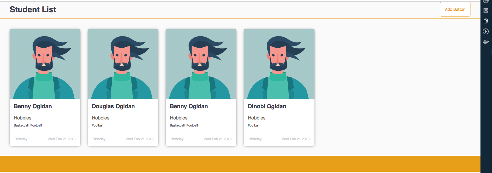

# Student Skill Cards List

[](https://greenkeeper.io/)

This is a full stack application that allows inidivduals to manage their students list




# Table of Contents

- [Getting Started](#getting-started)
- [Technology Stack](#technology-stack)
- [Installation](#installation)
- [Testing](#testing)
- [Questions](#questions)
- [Support or Contribution](#support-or-contribution)

## Getting Started
This is a fullstack javascript application built with [**Node JS**](https://nodejs.org/en/) using [**Express**](https://expressjs.com/) framework and [**Apollo GraphQL Server**](https://www.apollographql.com/) on the backend. The frontEnd is built with React JS with the aid of Apollo Client fetching the data from the backend. The backend application can be built with Docker


## Technology Stack
**Server Side**
1. NodeJS
2. Express FrameWork
3. Docker
4. React JS
5. Apollo GraphQL


## Installation

1. Install [**Node JS**](https://nodejs.org/en/).

2. Clone the [**repository here**](https://github.com/benfluleck/student-list-full-stack.git)
3. [**cd**] into the root of the **project directory**.
4. Run `yarn install` on the terminal to install project dependecies
5. Create a `.env` file in the root directory of the application. Example of the content of a .env file is shown in the .env.example

6. Start the application:
**_Different Build Environments_**


### For Server
**Development**
```
yarn server:dev
```
*N.B: The build is minified using Babel if you would like to unminify you have to edit the .babelrc*

- Navigate to `http://localhost:4000/graphql`

**Docker**
- To run the application in docker you need to install Docker.
There are some good docs [here](https://docs.docker.com/)
Open an .env file in the .docker folder to pass your environment variables to Docker

- To build the application and run docker
`docker-compose up --build`

- This will help to build the application, setup the migration with Sequelize.

### For Client
**Development**
```
yarn client:dev
```
- Navigate to `http://localhost:8000`

- The aim is to finish the client side and build with Docker

## StyleGuide

I have implemented react-style guide which helped with developing my UI components as I feel these are essential on any project.

You can launch this with `yarn styleguide`


## Testing

Server side tests - Run `yarn server:test` on the terminal while within the **project root directory**.

Server side testing is achieved through the use of `jest` package. `jest` is used to test javascript code in
React applications.

Client side testing is yet to be configured but is being worked on currently

## Questions
For more details contact benny.ogidan@andela.com

## Support or Contribution
For any suggestions or contributions or issues please do raise them or email me.
For **Contributiions**, Please clone the repo and implement a PR I would appreciate it

## Status
In Progress
